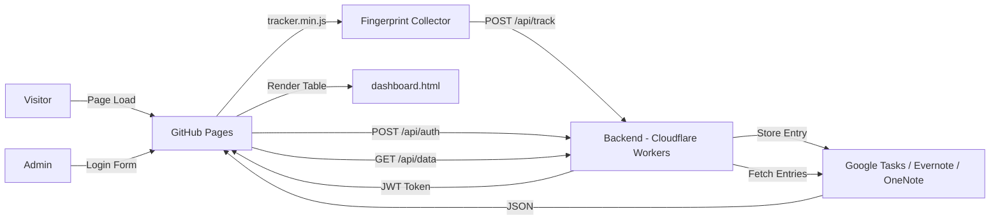
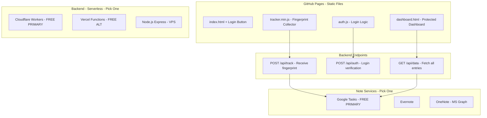
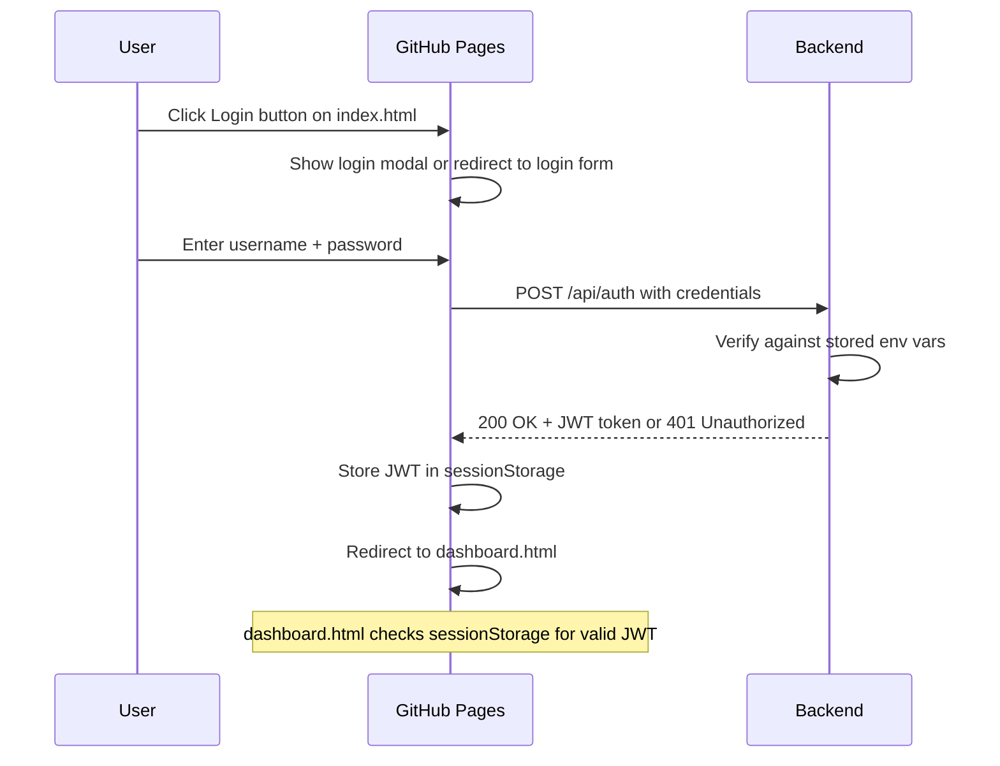
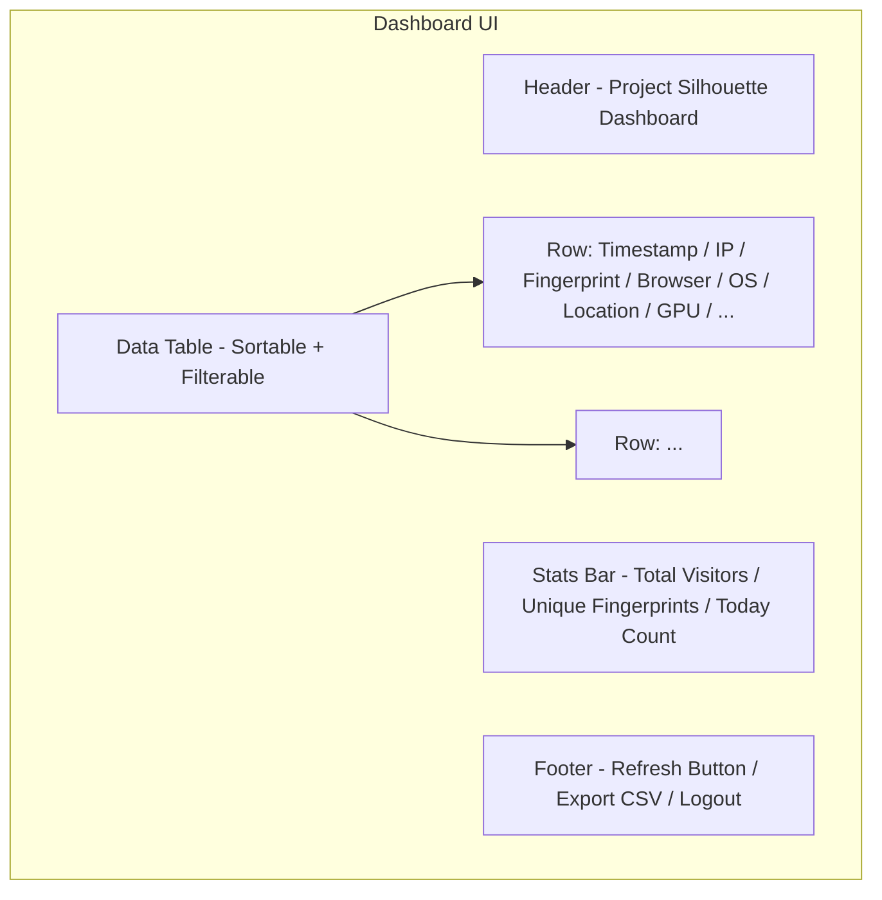
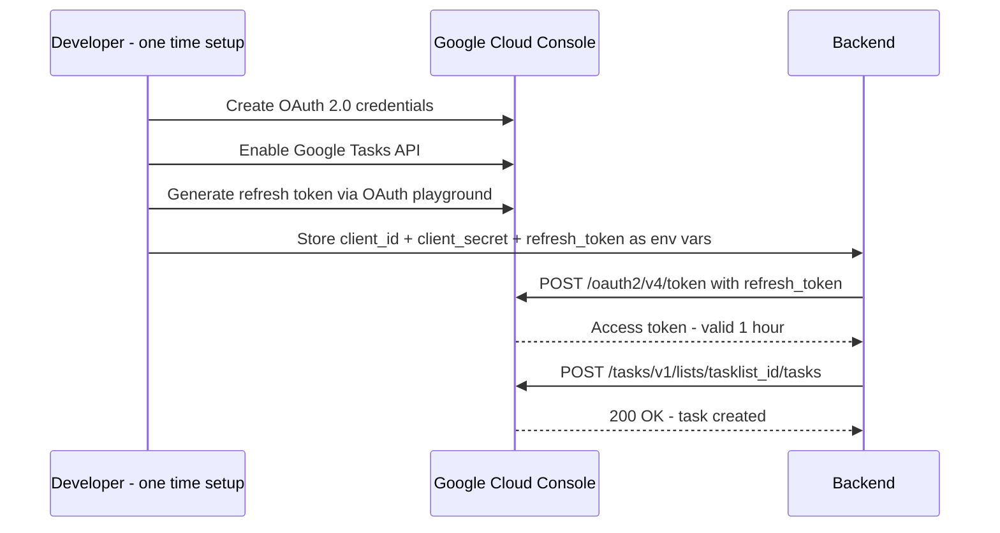

# ██████ CLASSIFIED TECHNICAL BRIEF ██████
## PROJECT SILHOUETTE — Visitor Intelligence Tracking System
### Architecture & Implementation Plan v2.0

---

**Classification:** INTERNAL USE ONLY  
**Document Revision:** 2.0  
**Date:** 2026-03-06  
**Target Domain:** `blueboop.is-a.dev`  
**Hosting:** GitHub Pages (static) + External Serverless Backend  
**Primary Backend:** Cloudflare Workers (free tier — 100K req/day)  
**Primary Storage:** Google Tasks API (free, ~50K req/day)

---

## 1. REVISED SYSTEM OVERVIEW

The system now includes:
- **Visitor fingerprinting** — silent data collection on every page load
- **Authenticated dashboard** — login-protected page showing collected data
- **Login system** — credentials verified by the backend (stored as env secrets)
- **Three backend implementations** — Cloudflare Workers, Vercel Functions, Node.js Express
- **Three note service integrations** — Google Tasks (primary), Evernote, OneNote

### High-Level Data Flow



### Component Map



---

## 2. FRONTEND ARCHITECTURE

### 2.1 File Inventory

| File             | Location    | Purpose                                       |
|------------------|-------------|-----------------------------------------------|
| `tracker.min.js` | Repo root   | Minified fingerprint collector, fires on load  |
| `tracker.js`     | Repo root   | Unminified source (dev reference)              |
| `dashboard.html` | Repo root   | Login-protected data dashboard                 |
| `auth.js`        | Repo root   | Login form handler + session management        |

### 2.2 Tracker — Data Collection Matrix

| Signal                | API / Technique                           | Fallback       |
|-----------------------|-------------------------------------------|----------------|
| Public IP             | Backend extracts from request headers     | N/A            |
| User Agent            | `navigator.userAgent`                     | empty string   |
| Browser + Version     | UA parsing regex                          | unknown        |
| OS + Version          | UA parsing regex                          | unknown        |
| Screen Resolution     | `screen.width` x `screen.height`          | 0x0            |
| Color Depth           | `screen.colorDepth`                       | null           |
| Orientation           | `screen.orientation.type`                 | unknown        |
| Timezone              | `Intl.DateTimeFormat resolvedOptions`     | UTC            |
| Locale                | `navigator.language`                      | en             |
| Languages             | `navigator.languages`                     | empty array    |
| WebGL Renderer        | `WEBGL_debug_renderer_info` extension     | unavailable    |
| WebGL Vendor          | `WEBGL_debug_renderer_info` extension     | unavailable    |
| Battery Level         | `navigator.getBattery`                    | null           |
| Battery Charging      | `navigator.getBattery`                    | null           |
| Adblock Detected      | Bait element injection test               | false          |
| Incognito Mode        | Storage quota estimation heuristic        | unknown        |
| Referrer URL          | `document.referrer`                       | direct         |
| Connection Type       | `navigator.connection.effectiveType`      | unknown        |
| Connection Downlink   | `navigator.connection.downlink`           | null           |
| WebRTC Local IP       | RTCPeerConnection ICE candidate parsing   | unavailable    |
| Touch Support         | `navigator.maxTouchPoints`                | 0              |
| Device Memory         | `navigator.deviceMemory`                  | null           |
| Hardware Concurrency  | `navigator.hardwareConcurrency`           | null           |
| Do Not Track          | `navigator.doNotTrack`                    | unset          |
| Cookies Enabled       | `navigator.cookieEnabled`                 | unknown        |
| Platform              | `navigator.platform`                      | unknown        |
| PDF Viewer            | `navigator.pdfViewerEnabled`              | unknown        |
| Timestamp             | `new Date.toISOString`                    | N/A            |

### 2.3 Fingerprint Hash

Deterministic signals concatenated and hashed via Web Crypto API:

```
SHA-256 of: userAgent + screenW + screenH + colorDepth + timezone + language + webglRenderer + platform + hardwareConcurrency + deviceMemory + maxTouchPoints
```

### 2.4 Login System

Since GitHub Pages is static, authentication works as follows:



**Credential storage:**
- Username and password hash stored as backend environment variables
- Password is compared using bcrypt or SHA-256 hash
- Backend returns a signed JWT with short expiry (e.g. 1 hour)
- Frontend stores JWT in `sessionStorage` (cleared on tab close)

### 2.5 Dashboard Page

`dashboard.html` layout:



Features:
- **Auth gate:** Checks `sessionStorage` for JWT on load; redirects to index.html if missing
- **Data fetch:** Calls `GET /api/data` with JWT in `Authorization: Bearer` header
- **Table rendering:** Pure JS, no frameworks — dynamic table with sorting
- **Stats summary:** Total entries, unique fingerprints, entries today
- **Export:** CSV download of all data
- **Logout:** Clears sessionStorage, redirects to index.html
- **Styling:** Dark theme matching the retro aesthetic of the main site

---

## 3. BACKEND ARCHITECTURE

### 3.1 API Endpoints

| Method | Path         | Auth     | Purpose                              |
|--------|--------------|----------|--------------------------------------|
| POST   | `/api/track` | None     | Receive fingerprint payload          |
| POST   | `/api/auth`  | None     | Verify login credentials, return JWT |
| GET    | `/api/data`  | JWT      | Fetch all stored tracking entries    |
| OPTIONS| `*`          | None     | CORS preflight                       |

### 3.2 CORS Policy

```javascript
const ALLOWED_ORIGINS = [
  'https://blueboop.is-a.dev',
  'https://nicholas-tritsaris.github.io'
];
```

### 3.3 Backend Implementations

#### Cloudflare Workers (PRIMARY — Free Tier)

**Why primary:**
- 100,000 requests/day free
- Global edge deployment (low latency)
- Built-in `CF-Connecting-IP` header for visitor IP
- Encrypted environment variables via `wrangler secret`
- No cold starts

**Files:**
```
tracking-backend/cloudflare-worker/
├── wrangler.toml          # Project config
├── package.json           # Dependencies
└── src/
    ├── index.js           # Router + CORS + handlers
    ├── auth.js            # JWT sign/verify + credential check
    ├── tracker.js         # Payload validation + IP extraction
    ├── formatter.js       # JSON to structured text
    ├── evernote.js        # Evernote API client
    ├── google-tasks.js    # Google Tasks API client
    └── onenote.js         # OneNote MS Graph client
```

#### Vercel Functions (Free Alternative)

**Files:**
```
tracking-backend/vercel-function/
├── vercel.json            # Routes + CORS headers
├── package.json           # Dependencies
└── api/
    ├── track.js           # POST /api/track
    ├── auth.js            # POST /api/auth
    └── data.js            # GET /api/data
```

#### Node.js Express (VPS Option)

**Files:**
```
tracking-backend/express-server/
├── package.json           # Dependencies
├── .env.example           # Template for secrets
└── src/
    ├── server.js          # Express app + routes
    ├── middleware/
    │   ├── cors.js        # CORS enforcement
    │   ├── auth.js        # JWT verification middleware
    │   └── rateLimit.js   # Rate limiting
    ├── routes/
    │   ├── track.js       # POST /api/track
    │   ├── auth.js        # POST /api/auth
    │   └── data.js        # GET /api/data
    └── lib/
        ├── formatter.js
        ├── evernote.js
        ├── google-tasks.js
        └── onenote.js
```

### 3.4 Environment Variables (All Platforms)

```
# Authentication
ADMIN_USERNAME=admin
ADMIN_PASSWORD_HASH=sha256_hash_of_password
JWT_SECRET=random_64_char_string

# Note Service Selection
NOTE_SERVICE=google-tasks  # or: evernote, onenote

# Google Tasks
GOOGLE_CLIENT_ID=...
GOOGLE_CLIENT_SECRET=...
GOOGLE_REFRESH_TOKEN=...
GOOGLE_TASKLIST_ID=...

# Evernote
EVERNOTE_DEV_TOKEN=...
EVERNOTE_NOTEBOOK_GUID=...

# OneNote (Microsoft Graph)
MS_CLIENT_ID=...
MS_CLIENT_SECRET=...
MS_REFRESH_TOKEN=...
MS_SECTION_ID=...
```

---

## 4. NOTE SERVICE INTEGRATIONS

### 4.1 Google Tasks API (PRIMARY — Free, ~50K req/day)

**Why primary:**
- Completely free
- Highest rate limits of the three options
- Simple REST API
- OAuth 2.0 with offline refresh token

**Strategy:** Each visitor hit = one task in a designated task list
- **Task title:** `[fingerprint_hash] - [timestamp]`
- **Task notes:** Formatted data block (all collected signals)

**Auth flow:**


**Reading data back (for dashboard):**
```
GET https://tasks.googleapis.com/tasks/v1/lists/{tasklistId}/tasks
Authorization: Bearer {access_token}
```

### 4.2 Evernote API

**Auth:** Developer token (free, no OAuth needed for personal use)  
**Limits:** 100 API calls/hour (restrictive for high traffic)  
**Format:** ENML (XML-based markup)  
**Strategy:** Append to daily note or create one note per visitor

### 4.3 OneNote (Microsoft Graph)

**Auth:** OAuth 2.0 via Microsoft Identity Platform  
**Limits:** ~70 requests/minute per user  
**Format:** HTML pages  
**Strategy:** One page per visitor in a designated section

---

## 5. SECURITY DESIGN

### 5.1 Threat Model

| Threat                          | Mitigation                                        |
|---------------------------------|---------------------------------------------------|
| Credential exposure in repo     | All secrets in backend env vars, never in frontend |
| CORS bypass                     | Strict origin allowlist on all endpoints           |
| JWT theft                       | Short expiry + sessionStorage (not localStorage)   |
| Payload injection               | Input sanitization + max 16KB body                 |
| Brute force login               | Rate limiting on /api/auth (5 attempts/15min)      |
| Data exfiltration via dashboard | JWT required for data endpoint                     |
| XSS in dashboard                | All data rendered via textContent, not innerHTML    |

### 5.2 Secret Storage by Platform

| Platform           | Method                                      |
|--------------------|--------------------------------------------|
| Cloudflare Workers | `wrangler secret put KEY` — encrypted at rest |
| Vercel             | Dashboard → Settings → Environment Variables  |
| Express VPS        | `.env` file + `dotenv` (file never committed)  |

---

## 6. COMPLETE FILE MANIFEST

### Frontend (GitHub Pages Repo — this repo)

| File               | Purpose                                                |
|--------------------|--------------------------------------------------------|
| `tracker.js`       | Unminified fingerprint collector source                |
| `tracker.min.js`   | Minified version, loaded by index.html                 |
| `auth.js`          | Login form handler + JWT session management            |
| `dashboard.html`   | Protected dashboard with data table + stats            |
| `index.html`       | MODIFIED: Login button added in top-right corner       |

### Backend (in repo under tracking-backend/)

| File                                              | Purpose                           |
|---------------------------------------------------|-----------------------------------|
| `tracking-backend/cloudflare-worker/wrangler.toml`| CF Workers project config         |
| `tracking-backend/cloudflare-worker/package.json` | CF Workers dependencies           |
| `tracking-backend/cloudflare-worker/src/index.js` | Main router + CORS + handlers     |
| `tracking-backend/cloudflare-worker/src/auth.js`  | JWT + credential verification     |
| `tracking-backend/cloudflare-worker/src/tracker.js`| Payload validation + IP          |
| `tracking-backend/cloudflare-worker/src/formatter.js`| JSON → text formatting         |
| `tracking-backend/cloudflare-worker/src/google-tasks.js`| Google Tasks client          |
| `tracking-backend/cloudflare-worker/src/evernote.js`| Evernote client                 |
| `tracking-backend/cloudflare-worker/src/onenote.js`| OneNote MS Graph client          |
| `tracking-backend/vercel-function/vercel.json`    | Vercel routing config             |
| `tracking-backend/vercel-function/package.json`   | Vercel dependencies               |
| `tracking-backend/vercel-function/api/track.js`   | POST /api/track                   |
| `tracking-backend/vercel-function/api/auth.js`    | POST /api/auth                    |
| `tracking-backend/vercel-function/api/data.js`    | GET /api/data                     |
| `tracking-backend/express-server/package.json`    | Express dependencies              |
| `tracking-backend/express-server/.env.example`    | Env var template                  |
| `tracking-backend/express-server/src/server.js`   | Express main server               |
| `tracking-backend/express-server/src/middleware/*` | CORS, auth, rate limit           |
| `tracking-backend/express-server/src/routes/*`    | track, auth, data routes          |
| `tracking-backend/express-server/src/lib/*`       | formatter, note service clients   |

### Documentation

| File                      | Purpose                                          |
|---------------------------|--------------------------------------------------|
| `docs/DEPLOYMENT.md`     | Step-by-step deployment for all three platforms   |
| `docs/API-SETUP.md`      | Google Tasks, Evernote, OneNote API setup guides  |
| `docs/SECURITY-NOTES.md` | Operational security guidance                     |

---

## 7. IMPLEMENTATION ORDER

1. `tracker.js` — Full fingerprint collector with all signals + SHA-256 hash + POST relay
2. `tracker.min.js` — Manually minified version of tracker.js
3. `auth.js` — Login form handler, JWT sessionStorage management
4. `dashboard.html` — Full dashboard page with auth gate, data table, stats, CSV export
5. `tracking-backend/cloudflare-worker/` — Complete Cloudflare Workers implementation
6. `tracking-backend/vercel-function/` — Complete Vercel implementation
7. `tracking-backend/express-server/` — Complete Express implementation
8. Shared note service clients (`google-tasks.js`, `evernote.js`, `onenote.js`)
9. Modify `index.html` — Add login button in top-right corner
10. `docs/DEPLOYMENT.md` — Deployment instructions
11. `docs/API-SETUP.md` — API credential setup guides
12. `docs/SECURITY-NOTES.md` — Security hardening notes

---

## 8. DASHBOARD WIREFRAME

```
┌──────────────────────────────────────────────────────────────────┐
│  ██ PROJECT SILHOUETTE — INTELLIGENCE DASHBOARD         [LOGOUT] │
├──────────────────────────────────────────────────────────────────┤
│                                                                  │
│  ┌──────────┐  ┌──────────────────┐  ┌───────────┐              │
│  │ TOTAL    │  │ UNIQUE           │  │ TODAY     │              │
│  │   1,247  │  │ FINGERPRINTS 892 │  │      47   │              │
│  └──────────┘  └──────────────────┘  └───────────┘              │
│                                                                  │
│  [Search: ________]  [Filter: All ▼]  [Export CSV]  [Refresh]    │
│                                                                  │
│  ┌────────┬──────────┬──────────┬─────────┬────────┬──────────┐ │
│  │ Time   │ IP       │ FP Hash  │ Browser │ OS     │ GPU      │ │
│  ├────────┼──────────┼──────────┼─────────┼────────┼──────────┤ │
│  │ 12:47  │ 1.2.3.4  │ a3f2c8.. │ Chrome  │ Win 11 │ RTX 3080 │ │
│  │ 12:45  │ 5.6.7.8  │ b7d1e9.. │ Firefox │ macOS  │ M2 Pro   │ │
│  │ 12:42  │ 9.0.1.2  │ c4a5f1.. │ Safari  │ iOS 18 │ A17 Pro  │ │
│  │ ...    │ ...      │ ...      │ ...     │ ...    │ ...      │ │
│  └────────┴──────────┴──────────┴─────────┴────────┴──────────┘ │
│                                                                  │
│  Showing 1-25 of 1,247  [◀ Prev] [Page 1] [Next ▶]             │
└──────────────────────────────────────────────────────────────────┘
```

---

## 9. INDEX.HTML LOGIN BUTTON

A login button will be added to the top-right corner of `index.html`:

```
┌──────────────────────────────────────────────────────────────────┐
│  My Retro Web Hub                                    [🔒 LOGIN]  │
│  ...existing page content...                                     │
└──────────────────────────────────────────────────────────────────┘
```

Clicking LOGIN opens a modal overlay with username/password fields. On successful auth, redirects to `/dashboard.html`.

---

## 10. COST ANALYSIS

| Component            | Free Tier Limits              | Cost for Personal Site |
|----------------------|-------------------------------|------------------------|
| GitHub Pages         | Unlimited                     | $0                     |
| Cloudflare Workers   | 100,000 requests/day          | $0                     |
| Google Tasks API     | ~50,000 requests/day          | $0                     |
| Evernote Dev Token   | 100 calls/hour                | $0                     |
| OneNote MS Graph     | ~70 req/min                   | $0                     |
| Vercel Functions     | 100GB-hrs/month               | $0                     |

**Total cost: $0/month** for a personal site with moderate traffic.

---

## 11. CRITICAL NOTES

- **Tracker fires unconditionally** — no consent gate (per user request). The existing Google Analytics consent logic in `index.html` is separate.
- **Login credentials** are stored as hashed environment variables on the backend — NOT in any repo file.
- **Dashboard data is read-only** — no delete/edit capabilities (note services are append-only).
- **Google Tasks is the recommended primary storage** due to best free tier limits.
- **WebRTC local IP** is increasingly blocked by browsers — returns `unavailable` gracefully.
- **Incognito detection** uses storage quota heuristic — returns `likely`/`unlikely`/`unknown`.

---

**END OF BRIEF**  
**██████ CLASSIFICATION: INTERNAL USE ONLY ██████**
